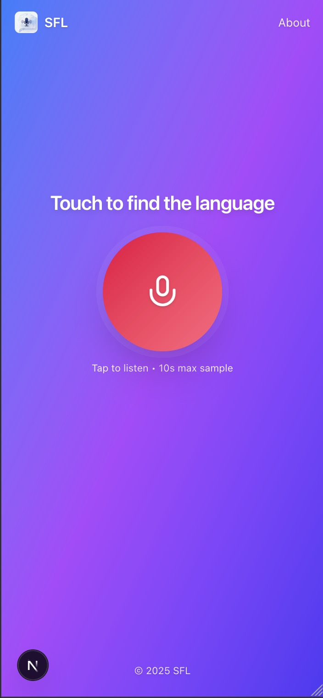
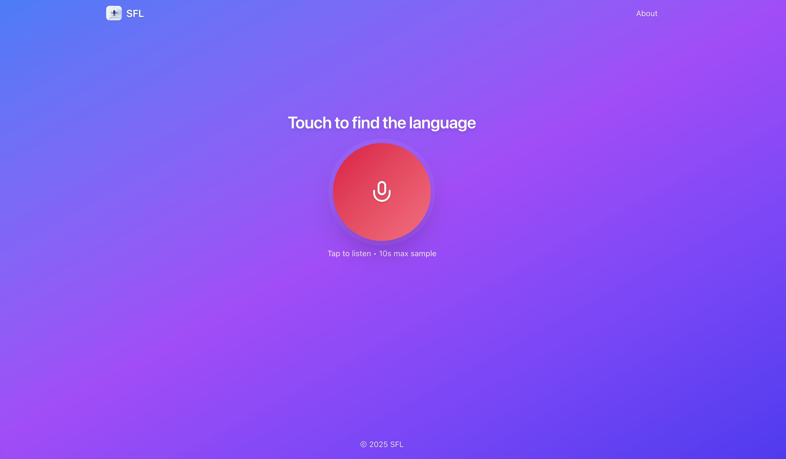

 
 
 
 # 🎧 Shazam for Languages

A fun side project I started while living in the beautiful Côte d’Azur 🇫🇷 — surrounded by tourists speaking every possible language.  
So I built this “Shazam for Language” app to **instantly recognize what language someone is speaking** and even **transcribe speech or videos**.

---

## Goal

The main idea is simple:
> Hear a voice → detect the language → show what was said.

Right now it works well for:
- 🎤 **Live speech recognition**
- 🎬 **Video/audio transcription**

Next, I’m working on **fine-tuning for low-resource African languages**.(focus on Wolof & Fula)

---

## 📱🖥️ Previews

  
  

## Tech Stack

| Layer | Tech |
|-------|------|
| Frontend | **NextJS** () |
| Backend | **Python FastAPI** |
| Core Tasks | Language recognition, speech transcription, and dataset fine-tuning for underrepresented languages |

---

---

